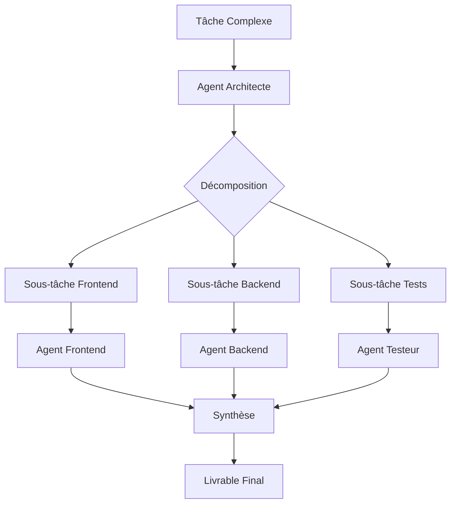

# Multi-Agent Orchestration

Ce skill permet de gérer des tâches complexes en les décomposant et en coordonnant plusieurs agents spécialisés.

## Quand utiliser ce skill

- Tâches impliquant plusieurs domaines (frontend + backend + tests)
- Refactoring à grande échelle
- Création de nouvelles fonctionnalités complexes
- Migrations de code

## Rôles d'Agents

### 🏗️ Agent Architecte
**Responsabilités :**
- Définir la structure globale
- Identifier les dépendances
- Créer le plan d'implémentation

### 💻 Agent Développeur Frontend
**Responsabilités :**
- Créer les composants React
- Implémenter les styles
- Gérer l'état de l'interface

### 🔧 Agent Développeur Backend
**Responsabilités :**
- Créer les routes API
- Gérer la base de données
- Implémenter la logique métier

### 🧪 Agent Testeur
**Responsabilités :**
- Écrire les tests unitaires
- Vérifier les scénarios edge-case
- Valider le comportement

### 📝 Agent Documenteur
**Responsabilités :**
- Documenter le code
- Mettre à jour le README
- Créer les guides d'utilisation

## Workflow d'Orchestration



## Template de Décomposition

```markdown
## Tâche : [Nom de la tâche]

### Phase 1 : Analyse (Architecte)
- [ ] Analyser les exigences
- [ ] Identifier les composants impactés
- [ ] Créer le plan d'implémentation

### Phase 2 : Implémentation Parallèle
#### Frontend
- [ ] Sous-tâche 1
- [ ] Sous-tâche 2

#### Backend
- [ ] Sous-tâche 1
- [ ] Sous-tâche 2

### Phase 3 : Intégration
- [ ] Connecter frontend et backend
- [ ] Tests d'intégration

### Phase 4 : Finalisation
- [ ] Tests complets
- [ ] Documentation
- [ ] Review
```

## Instructions

Pour orchestrer une tâche complexe :
- "Décompose la création d'un système d'authentification"
- "Orchestre le refactoring des pages"
- "Coordonne l'ajout d'une nouvelle fonctionnalité X"

L'agent commencera par analyser la tâche, la décomposer, puis exécuter chaque sous-tâche de manière coordonnée.
