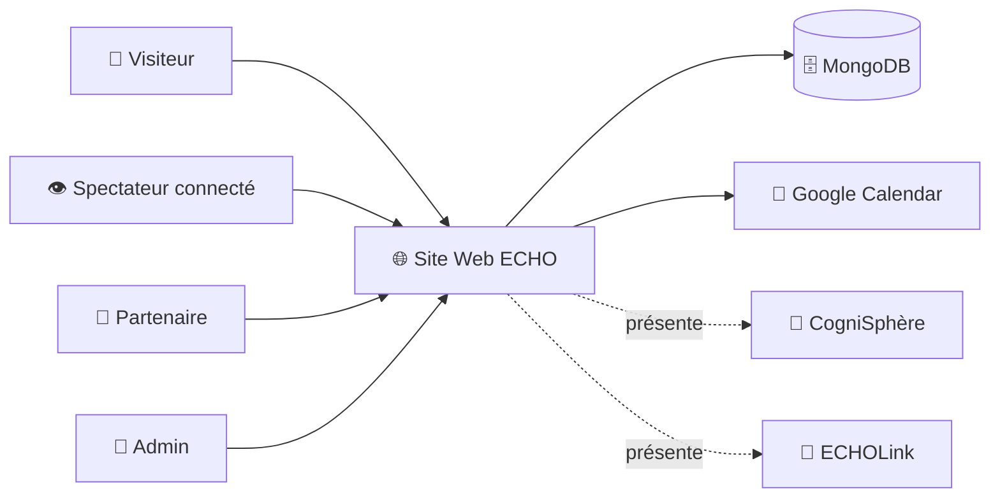

# Product Requirements Document - Mouvement ECHO

**Author:** JeReM
**Date:** 2026-03-04

---

## Executive Summary

> *Mouvement ECHO est un projet transmédia porté par une association fondée en 2023. La plateforme web sert de hub central pour la websérie (3 saisons × 11 épisodes), le réseau de partenaires (ECHOSystem), et la découverte des applications satellites CogniSphère et ECHOLink. Ce PRD couvre le périmètre du site web uniquement.*

*« Ne soyez pas simplement spectateur de l'histoire, écrivez-la avec nous ! »*

### Contexte & Vision

**Mouvement ECHO** est une association fondée en 2023 par Jérémy Lasne et Eddyason Koffi, née d'une amitié, d'une vision empreinte d'humanité, et d'une volonté de faire "notre part". L'équipe compte une dizaine de membres actifs, dont Clément Grandmontagne (coréalisateur), Déborah Prévaud (coordinatrice) et Thierry Korutos-Chatam (responsable des partenariats).

**Conviction :** *L'audiovisuel a le pouvoir de toucher les cœurs afin de faire évoluer les mentalités et les comportements en faveur de la préservation de la vie.*

**Raison d'être triple :** Raviver la flamme, encourager la volonté d'agir pour la collectivité, et créer du lien entre les individus.

**Ambition :** Semer les graines d'un nouveau paradigme — un écosystème transparent et fédérateur proposant biens, services et savoirs à contribution équitable, gratuite ou via le troc, dans une logique de réciprocité inspirée de la sobriété heureuse (Pierre Rabhi).

**Proposition :** *Une Série pour informer, Un Mouvement pour fédérer, et deux Plateformes numériques pour agir !*

### Périmètre du Site Web (scope de ce PRD)

Le site web est le **hub central de la Phase 1** du projet ECHO.

| Fonction | Description | État actuel |
|----------|-------------|-------------|
| **Vitrine série** | Websérie, bande-annonce, épisodes, personnages et réseaux sociaux | ✅ Implémenté |
| **Visionnage** | Streaming épisodes + suivi de progression | ✅ Implémenté |
| **Candidature partenaire** | Formulaire multi-étapes avec upload logo, géolocalisation | ✅ Implémenté |
| **Espace partenaire** | Profil partenaire, mise à jour fiche, gestion logo | ✅ Implémenté |
| **Admin partenaires** | Liste, approbation, rejet, mise en avant | ✅ Implémenté |
| **Prise de RDV partenaire** | Embed Google Calendar pour contractualiser un partenariat | 🆕 À développer |
| **Présentation CogniSphère** | Page découverte + formulaire recrutement développeurs | ⚠️ Page existante, formulaire manquant |
| **Présentation ECHOLink** | Page découverte + formulaire recrutement développeurs | ⚠️ Page existante, formulaire manquant |
| **Événements** | Listing événements, ciné-débats, réservation | ✅ Implémenté |
| **Ressources** | Médiathèque liée aux thématiques des épisodes | ✅ Implémenté |
| **Contact** | Formulaire de contact avec confirmation d'envoi | ⚠️ Implémenté (email_service stub) |
| **Soutien** | Page de dons avec paliers de contribution | ⚠️ Implémenté (intégration paiement en cours) |
| **Mouvement** | Présentation du mouvement, équipe, timeline | ✅ Implémenté |
| **Auth** | Inscription, connexion classique, Google OAuth, 2FA | ✅ Implémenté |
| **Admin contenus** | CRUD épisodes, thématiques, ressources, acteurs, utilisateurs | ✅ Implémenté |

> ⚠️ **Hors périmètre :** CogniSphère et ECHOLink sont des applications distinctes avec leurs propres PRDs.

> 🔧 **Prise de RDV :** Implémentation recommandée en embed Google Calendar (intégration simple). Évolution API Google Calendar ultérieure si besoin.

### Diagramme de Contexte

### La Série — Structure narrative

Structure en 3 saisons × 11 épisodes inspirée de *La Divine Comédie* de Dante.

| Phase | Saison | Acronyme ECHO | Objectif |
|-------|--------|---------------|----------|
| **L'Éveil** | S1 — L'Enfer | *Elevating Consciousness, Hope, and Oneness* | Décrypter les vices, redonner confiance |
| **Le Changement** | S2 — Le Purgatoire | *Empowering Change and Harmony for Our Planet* | Solutions tangibles, mobiliser |
| **La Régénération** | S3 — Le Paradis | *Earth's Conservation and Healing Organization* | Préserver, restaurer, co-créer |

### Écosystème Futur (hors périmètre web)

- **CogniSphère** — Système d'apprentissage calibré sur la courbe d'oubli d'Ebbinghaus.
- **ECHOLink** — Plateforme d'action citoyenne avec carte interactive et réciprocité.
- **Énigmes post-épisode** — Gamification transmédia (Oct/Nov 2026).

### Ce qui rend ECHO spécial

- **Œuvre d'art totale** — Fiction ancrée dans la réalité, intégrant la scène rap et la culture urbaine.
- **Transmédia** — Énigmes, approfondissement thématique, actions concrètes.
- **Mouvement, pas produit** — Écosystème collaboratif pour bâtir un avenir meilleur.
- **Contre-récit générationnel** — Un horizon désirable face à la crise de santé mentale des jeunes.

## Project Classification

| Dimension | Valeur |
|-----------|--------|
| **Type** | Plateforme web interactive (React 19 / TypeScript / FastAPI / MongoDB) |
| **Domaine** | Média culturel / Éducation sociale / Transmédia |
| **Complexité** | Medium |
| **Contexte** | Brownfield — 30+ endpoints, 10 pages, 8 collections MongoDB |
| **Scope PRD** | **Site web Phase 1 uniquement** |
| **KPIs** | Vues vidéo, partenaires actifs, dons, participation |

### Calendrier

| Échéance | Contenu |
|----------|---------|
| **🚀 20 mars 2026** | **Site web prêt** — consolidation existant, correctifs sécurité, quick wins |
| **Post-lancement** | Fonctionnalités additionnelles : formulaires CogniSphère/ECHOLink, RDV Google Calendar, Hero refondée, Auth Context, optimisations |
| **Oct/Nov 2026** | Gamification — Énigmes post-épisode |

## Success Criteria

### Succès Utilisateur

| # | Métrique | Cible |
|---|---------|-------|
| 1 | Complétion bande-annonce | > 98% |
| 2 | Complétion épisodes | > 70% (stretch : 85%) |
| 3 | Rétention inter-épisode (E(N) → E(N+1)) | Mesurée, croissante |
| 4 | Taux de rebond accueil | < 40% |
| 5 | Taux de rebond global | < 50% |
| 6 | Complétion formulaire partenaire | > 80% |
| 7 | Complétion profil partenaire (logo+desc+site) | Mesurée, croissante |
| 8 | Qualité candidatures dev (compétences/motivation) | Mesurée via champs formulaire |
| 9 | Conversion visiteur → inscription | Mesurée |

### Succès Business

| # | Métrique | Cible | Horizon |
|---|---------|-------|---------|
| 10 | Visiteurs uniques | 100 000 | 3 mois post-lancement |
| 11 | Sources d'acquisition (UTM) | Trackées par canal | Dès lancement |
| 12 | Partenaires recrutés | 3/semaine | Post-lancement |
| 13 | Clics "Visiter le site" partenaire | Traçable par partenaire | Dès lancement |
| 14 | Partages sociaux | Mesurés via boutons partage | Dès lancement |
| 15 | Dons collectés | 30 000 € (Phase 1) | À confirmer |
| 16 | Funnel conversion dons | Parcours trackés dans GA4 | Dès lancement |
| 17 | Candidatures dev | 50 (CogniSphère + ECHOLink) | 3 mois post-lancement |

### Succès Technique

| # | Métrique | Cible | Outil |
|---|---------|-------|-------|
| 18 | Disponibilité | 99.5%+ | UptimeRobot |
| 19 | Performance | < 3s chargement | PageSpeed Insights |
| 20 | Sécurité | 0 vulnérabilité HIGH ouverte | Code review |
| 21 | Déploiement | ✅ 20 mars 2026 | — |

### Résultats Mesurables

| # | Résultat | Comment mesurer |
|---|----------|----------------|
| 1 | 100K visiteurs en 3 mois | Google Analytics 4 |
| 2 | 3 partenaires/semaine | Compteur candidatures backend |
| 3 | 50 candidatures dev | Compteur formulaires CogniSphère/ECHOLink |
| 4 | > 70% complétion vidéo | Collection `video_progress` (progress_percent) |
| 5 | Visibilité partenaires | Clics "Visiter le site" (event tracking) |
| 6 | 30K€ collectés (Phase 1) | Plateforme de paiement |
| 7 | Sources d'acquisition identifiées | UTM Google Analytics |
| 8 | Parcours conversion dons | Funnel GA4 |

## User Journeys

### 1. 🌍 Youssef, l'Étudiant Engagé (Visiteur → Inscrit)
**Situation :** Youssef, 21 ans, ressent de l'éco-anxiété. Il voit passer un extrait percutant de la série ECHO sur Instagram avec un beat rap.
**Le Parcours :**
- Youssef arrive sur la page d'accueil d'ECHO sur son mobile. En 30 secondes, il lit l'elevator pitch et comprend la dimension "Mouvement".
- Sur la page **La Série**, il regarde la bande-annonce. Intrigué, il clique sur "Voir l'Épisode 1".
- **Friction positive :** Le système l'informe que pour visionner le contenu intégral, rejoindre le mouvement et sauvegarder sa progression, il doit créer un compte.
- Youssef utilise le bouton "Continuer avec Google" pour s'inscrire en un clic.
- **Résultat :** Youssef est connecté et prêt à commencer son visionnage intégral.

### 2. 👁️ Luna, la Militante Inspirée (Spectatrice Connectée)
**Situation :** Luna a commencé l'épisode 1 la semaine dernière et revient pour la suite.
**Le Parcours :**
- Luna veut se connecter mais a oublié son mot de passe. Elle utilise le flux *"Mot de passe oublié"* et reçoit un lien sécurisé par email pour le réinitialiser.
- Une fois connectée, son tableau de bord indique où elle s'est arrêtée. Elle relance la vidéo, qui reprend là où elle l'avait laissée.
- La vidéo se termine. Le système enregistre 100% de complétion et débloque l'épisode 2.
- Touchée par l'épisode, elle navigue vers la page **Mouvement** puis clique sur **Soutenir** pour faire un petit don à l'association.
- **Résultat :** Luna est passée de spectatrice à actrice du changement financier.

### 3. 🤝 Marc, le Gérant de FabLab (Candidat Partenaire)
**Situation :** Marc cherche à donner du sens à son atelier collaboratif et souhaite l'inscrire sur ECHOLink.
**Le Parcours :**
- Marc visite la page **ECHOSystem**, voit la carte interactive et clique sur "Rejoindre le Mouvement".
- Il remplit le **Formulaire partenaire** (informations, géolocalisation, logo).
- L'équipe ECHO reçoit une notification ; Marc reçoit un email de confirmation de réception.
- Dans son nouvel **Espace Partenaire**, son statut est *"En cours d'étude"*. Un message l'invite à réserver un créneau sur le **Google Calendar (embed) de l'équipe** pour une présentation.
- **Process hors-ligne :** Ils font la présentation visio. Marc reçoit ensuite son contrat par email de l'équipe ECHO (hors-plateforme), le signe et le renvoie.
- Sarah (Admin) valide manuellement son compte depuis le back-office.
- **Résultat :** Marc est désormais visible sur la carte publique ECHOSystem.

### 4. 🔧 Sarah, Coordinatrice ECHO (Admin)
**Situation :** Sarah coordonne quotidiennement le back-office du projet.
**Le Parcours :**
- Sarah se connecte (avec vérification 2FA pour la sécurité). Le backend authentifie son rôle `ADMIN`.
- Dans le **Panel d'Administration**, elle note la réception du contrat de Marc (signé hors-plateforme).
- Elle ouvre la fiche partenaire de Marc, clique sur "Approuver" et coche "Mettre en avant" pour le valoriser.
- Elle passe ensuite à l'onglet **Agenda** de l'admin et ajoute les dates d'un prochain ciné-débat de la saison 1.
- **Résultat :** Le site public est instantanément mis à jour.

### 5. 💻 Alex, le Développeur Tech for Good (Candidat Dev)
**Situation :** Alex, dev React, cherche un projet open-source utile.
**Le Parcours :**
- Sur la page **CogniSphère**, il est convaincu par la roadmap pédagogique (courbe d'Ebbinghaus) et clique sur "Rejoindre l'équipe de développement".
- Il remplit le formulaire qualifié, détaillant sa stack et sa motivation.
- **Validation technique :** Le système vérifie que les champs obligatoires sont remplis et passe un filtre anti-spam (ex: reCAPTCHA) pour éviter à l'équipe de recevoir des candidatures poubelles.
- L'équipe ECHO reçoit l'alerte qualifiée et contacte Alex via Discord.
- **Résultat :** Amorçage du recrutement technique pour les plateformes futures.

### Journey Requirements Summary (Impact Scope)
- **Onboarding :** Inscription obligatoire pour visionnage + Google OAuth + Flux Reset Password sécurisé.
- **Visionnage :** Player résilient + Sauvegarde d'état DB + Déblocage conditionnel (`video_progress`).
- **Workflow Partenaire :** Formulaire (géocoding/upload) + Mails transactionnels + Embed Google Calendar + Statuts backend (En attente/Approuvé).
- **Admin :** RBAC + 2FA + Interface CRUD (Partenaires et Événements).
- **Acquisition Technique :** Formulaire candidature qualifié + validation frontend/backend anti-spam.

## Domain-Specific Requirements

### Compliance & Réglementation

- **Protection des données (RGPD) :** Pas de restriction stricte d'âge pour développer le mouvement, mais ajout d'une case obligatoire à l'inscription : *"Je certifie avoir plus de 15 ans ou avoir l'accord de mon représentant légal"*. Recueil du consentement (CGU, Politique de Confidentialité).
- **Transactions financières :** Sous-traitées intégralement via une plateforme tierce certifiée (HelloAsso recommandée) afin de ne manipuler aucune donnée bancaire sensible (PCI-DSS) sur nos serveurs.
- **Hébergement & Infra :** Les bases de données (MongoDB) et plateformes cloud (Firebase/Netlify) doivent impérativement être instanciées sur une région européenne (ex: `eu-central` ou `eu-west`) pour garantir la souveraineté des données RGPD.

### Risques & Liability (Modération)

- **Contenu Généré par les Utilisateurs (UGC) :** Risque NUL en Phase 1. Hormis les partenaires, les utilisateurs ne peuvent pas poster de contenu public.
- **Workflow de validation Partenaires :** Bien que les candidats partenaires puissent uploader un logo et une description de leur structure, **aucun contenu partenaire n'est rendu public sans l'approbation explicite et manuelle d'un Administrateur**. Cela garantit le contrôle éditorial de la plateforme face aux contenus inappropriés ou malveillants.

### Accessibilité & Inclusion

- **Phase 1 (MVP) :** Le site n'est volontairement pas contraint par les standards stricts d'accessibilité (WCAG 2.1 AA) pour le lancement de mars 2026.
- **Phase 3 (Vision) :** L'accessibilité numérique sera un chantier ultérieur pour s'aligner sur les valeurs inclusives du Mouvement.

### Intégration Systèmes

- **Paiements / Dons :** Intégration par un simple bouton de redirection sortant vers la page d'une plateforme (HelloAsso/Banque). Sécuritaire (évite les conflits d'iframes et les problèmes de CSP/Content Security Policy).
- **Streaming Sécurisé :** Progression trackée en base (`video_progress`) ; pas de DRM lourde pour ce MVP grand public.

## Web App & API Backend Requirements

### 1. Architecture Frontend & SEO
- **Modèle :** Application Single Page (SPA) en React/Vite.
- **Criticalité SEO (MVP) :** Le SEO est critique dès le lancement. Mise en place d'un plugin de pré-rendu au build (ex: `vite-plugin-prerender` ou SSG) pour servir un HTML statique complet aux robots d'indexation (crawlers Google) et inclure les balises Open Graph pour les partages sociaux fluides. Viser 100/100 sur Lighthouse SEO.

### 2. Support Navigateurs & Mobilité
- **Mobile-first :** L'interface doit être initialement pensée pour des résolutions mobiles (Smartphones), fluidement adaptative (Responsive) vers tablette et desktop.
- **Navigateurs cibles :** Navigateurs modernes "Evergreen" (Chrome, Edge, Safari, Firefox des 3 dernières années). Pas de polyfills coûteux pour navigateurs obsolètes (IE11).

### 3. API & Communication (Backend)
- **Protocole & CORS :** API REST (Flask) communiquant en JSON avec le frontend (React). Pour des raisons strictes de sécurité (MVP), implémentation de **CORS restrictifs** n'autorisant que le domaine frontend en production (pas de joker `*`).
- **Extensibilité & Versioning :** L'API doit être conçue pour de futurs clients tiers (CogniSphère, ECHOLink). Les routes doivent utiliser un espace de noms versionné (`/api/v1/...`).
- **Authentification Stateless :** L'authentification API utilisera un protocole standard stateless basé sur des tokens **JWT**, permettant aux applications mobiles ou tierces futures de consommer l'API facilement.

### 4. Stratégie de Performance (Streaming Vidéo)
- **Hébergement Média Externe :** Vidéos d'épisodes hébergées par un tiers (Vimeo Pro / YouTube paramétré) pour garantir un uptime de 99.5% face aux pics de charge.
- **Marque Blanche (White-label) :** Configuration stricte du lecteur tiers (ex: `?rel=0`) pour empêcher l'affichage de vidéos "Recommandées / Autres créateurs" à la fin de l'épisode, garantissant l'immersion esthétique et thématique dans le Mouvement ECHO.

## Product Scope & Boundaries

### MVP Strategy & Philosophy (20 mars 2026)
**MVP Approach:** "Experience MVP" — Une immersion immédiate, esthétique et fonctionnelle qui prouve le concept du "Mouvement" et centralise la communauté, sans accumulation excessive de fonctionnalités techniques complexes (ex: pas d'API Calendar custom, juste un lien/embed sécurisé ; pas de moteur de recommandations vidéo).
**Objectif de Lancement :** Consolidation de l'existant, correctifs sécurité, quick wins SEO.

#### MVP Feature Set (Phase 1)
- Quick wins SEO (meta tags, favicon, SSG pour Open Graph) [🔴 Critique]
- Sécurisation : Page 404, Mots de passe forts, Correctifs sécurité [🔴 Critique]
- Partenaires : Formulaire complet (upload logo/géocoding), Admin Validation, Bouton "Visiter le site" [🔴 Critique]
- Embed Google Calendar (RDV partenaires) [🔴 Critique]
- Acquisition : Inscription/OAuth, Boutons partage social, Formulaires CogniSphère/ECHOLink [🔴 Critique]
- Tracking : Configurer GA4 + UptimeRobot [🔴 Critique]
- Soutien : Boutons de redirection plateforme dons (HelloAsso) [🟡 Important]
- Média : Lecteur bande-annonce externe (marque blanche) [🟡 Important]

### Post-MVP Features

#### Phase 2 — Growth (Printemps/Été 2026)
- Refonte UX de la Hero Section ("Une websérie qui éveille les consciences")
- Auth Context React + ProtectedRoute centralisé
- Skeletons de chargement et Error Boundary React global
- Optimisation fine des images (Lazy loading, srcSet)
- Pagination API (cursor-based)
- Déploiement CI/CD (GitHub Actions) + E2E Tests (Playwright)
- Endpoint analytics vidéo / Tracking clics partenaires

#### Phase 3 — Expansion (Automne 2026+)
- Outil Éducatif interactif (CogniSphère)
- Base de données inter-associative (ECHOLink)
- Gamification transmédia (Énigmes post-épisode)
- Collection `donations` interne + intégration paiement native
- API Google Calendar avancée

### Risk Mitigation Strategy
- **Technical Risks:** Sous-estimation temps intégration fonctionnalités tierces (Calendar). *Mitigation:* Utilisation de liens simples/embeds pour MVP plutôt que des clients API complets.
- **Market Risks:** Mauvais référencement initial au lancement du site. *Mitigation:* Pré-rendu (SSG) imposé pour le SEO dès la Phase 1.
- **Resource Risks:** Délai très court d'ici au 20 mars 2026. *Mitigation:* Périmètre strictement verrouillé sur acquisition et POC de visionnage, optimisations repoussées en Phase 2.

## Functional Requirements

*(Rappel : Ces capacités constituent le périmètre contractuel du produit. Toute fonctionnalité non listée ici est considérée hors-périmètre pour la Phase 1).*

### 1. Gestion des Utilisateurs (Onboarding & Auth)
- **FR1 :** Les visiteurs peuvent créer un compte via OAuth (Google). *[Trace : Youssef]*
- **FR2 :** Les utilisateurs peuvent se connecter via email/mot de passe avec validation de format. *[Trace : Youssef, Luna]*
- **FR3 :** Les utilisateurs isolés (mot de passe oublié) peuvent le réinitialiser via un lien sécurisé envoyé par email. *[Trace : Luna]*
- **FR4 :** Le système intègre une case à cocher stipulant l'âge (>15 ans ou accord parental) lors de l'inscription pour conformité RGPD. *[Trace : Contrainte Légale]*
- **FR5 :** Les visiteurs non connectés ne peuvent pas accéder aux formulaires d'alertes (lead gen) ni à l'espace membre, mais voient systématiquement une incitation à l'action invitant à rejoindre le Mouvement. *[Trace : Acquisition Lead Gen]*

### 2. Expérience de Visionnage et Acquisition (Lead Gen)
- **FR6 :** Les visiteurs peuvent visionner la bande-annonce de la série sans créer de compte (lecteur média externe intégré). *[Trace : Youssef]*
- **FR7 :** Le système affiche "Bientôt disponible" ou une étiquette spécifique sur les Épisodes 1 à 5 qui n'entreront en production qu'en septembre 2026. *[Trace : UX Clarification]*
- **FR8 :** Les visiteurs peuvent cliquer sur les cartes "Épisodes 1 à 5" pour afficher une modale (ou pop-up/page) décrivant le titre, le synopsis et les thématiques couvertes. *[Trace : Youssef]*
- **FR9 :** Les utilisateurs inscrits peuvent s'inscrire aux notifications/alertes email concernant la future sortie (Automne 2026) des épisodes de la Saison 1. *[Trace : Stratégie Rétention]*

### 3. Acquisition et Gestion Partenaires (ECHOSystem)
- **FR10 :** Les visiteurs peuvent consulter la carte interactive ou la liste ECHOSystem affichant l'ensemble des partenaires actuels et validés. *[Trace : Marc]*
- **FR11 :** Les candidats partenaires peuvent remplir un "Formulaire de Candidature" complet (incluant coordonnées, description, localisation géographique, et upload d'un fichier image Logo). *[Trace : Marc]*
- **FR12 :** Le système envoie un email transactionnel récapitulatif ("Demande reçue") au candidat partenaire lors de la soumission de sa candidature. *[Trace : Marc]*
- **FR13 :** Le système envoie un email d'alerte à l'adresse de contact interne Mouvement ECHO pour chaque nouvelle candidature partenaire reçue. *[Trace : Sarah]*
- **FR14 :** Les partenaires ayant un compte peuvent consulter le statut actuel de leur candidature (ex : "En cours d'étude", "Validé") dans un Tableau de Bord Membre (Dashboard). *[Trace : Marc]*
- **FR15 :** Les partenaires peuvent accéder via leur menu à un bouton ou widget (embed/URL redirect) "Prendre Rendez-vous" pointant vers l'agenda Google du Mouvement. *[Trace : Marc]*
- **FR16 :** Les visiteurs publics de la page ECHOSystem peuvent cliquer sur le bouton "Visiter le site" de chaque partenaire individuel pour ouvrir leur URL dans un nouvel onglet. *[Trace : UX Visiteur]*

### 4. Recrutement Technique & Soutien Financier
- **FR17 :** Les développeurs ou technophiles intéressés peuvent soumettre leur profil via les formulaires de candidature spécifiques aux projets CogniSphère et ECHOLink. *[Trace : Alex]*
- **FR18 :** Tous les formulaires de collecte (recrutement tech et partenaires) intègrent une vérification anti-spam basique frontend/backend. *[Trace : Sécurité]*
- **FR19 :** Toute section appelant au don financier (ex: "Soutenir le Mouvement") propose au clic un ou plusieurs liens de redirection HTTPS sortants vers les prestataires retenus par l'association (ex: Campagne HelloAsso). *[Trace : Luna]*

### 5. Administration & Contrôle Editorial (Back-Office)
- **FR20 :** Les utilisateurs détenant le rôle "Administrateur" (via vérification stricte en Base de Données) détiennent de manière exclusive l'accès au Panel d'Administration (Dashboard Admin). *[Trace : Sarah]*
- **FR21 :** Les Administrateurs peuvent basculer le statut d'un partenaire candidat de "En Attente" à "Approuvé" dans l'interface CRUD du Panel d'Administration, déclenchant son affichage public immédiat. *[Trace : Sarah]*
- **FR22 :** Les Administrateurs peuvent modifier, supprimer ou mettre en avant (ordre d'affichage préférentiel) les partenaires existants. *[Trace : Sarah]*
- **FR23 :** Les Administrateurs peuvent créer, supprimer ou modifier les textes, statuts et dates des événements publiés dans l'Agenda public ("Épisodes IRL" ou projections). *[Trace : Sarah]*
- **FR24 :** Les Administrateurs peuvent exporter et/ou visualiser toute la base email des utilisateurs inscrits ayant coché leur consentement aux campagnes d'information liées à la série. *[Trace : Analyse Données]*

## Non-Functional Requirements

### Performance
- **NFR-Perf-1 (Temps d'Interaction) :** Le Temps d'Interaction Périphérique (Time to Interactive - TTI) de la page d'accueil ne doit pas excéder **3 secondes** sur une connexion mobile 4G standard.
- **NFR-Perf-2 (Feedback Formulaires) :** Les soumissions de formulaires critiques (Inscription, Candidature Partenaire) doivent retourner un feedback visuel assertif (loader/succès/erreur) en **< 1.5 seconde**.
- **NFR-Perf-3 (Budget Poids) :** Le bundle JavaScript compressé initial (Gzip/Brotli) délivré sur la première visite ne doit pas excéder **300 Ko**. Aucun chargement de média lourd (iframe vidéo externe) ne doit bloquer le fil principal CSS/JS (`main thread`) lors du rendu initial.

### Sécurité
- **NFR-Sec-1 (Cryptographie) :** Tous les mots de passe utilisateurs sont hachés de manière asymétrique (ex: bcrypt/Argon2) en base de données avec sel (salt) cryptographique unique.
- **NFR-Sec-2 (Headers & CORS) :** L'authentification OAuth et les routes de données de l'API Backend sont isolées nativement contre les vecteurs d'attaque CSRF et XSS via une politique stricte des origines (CORS) restreinte au seul domaine frontal de production.
- **NFR-Sec-3 (Vérification Fichiers Uploadés) :** Le système de soumission des Logos Partenaires bloquera strictement tout fichier dépassant **2 Mo**. Le Backend de validation s'assurera du type MIME réel (restreint à JPEG, PNG, WebP) quel que soit le suffixe de fichier, prémunissant contre l'injection de scripts malveillants.
- **NFR-Sec-4 (Rate Limiting) :** Afin de stériliser les attaques de type fuzzing de bots ou brute foce, un système minimal de filtrage (*Rate Limiting*) imposera un seuil critique d'environ **5 requêtes par IP par minute** sur les endpoints d'inscriptions et formulaires de contact brut.

### Scalabilité
- **NFR-Scale-1 (Capacité de Charge) :** L'architecture (couple CDN/React + API Flask) doit démontrer une résilience permettant d'absorber des pics d'affluence soudains de **2 000 requêtes simultanées** (Uptime cible 99%), sans excéder 20% de dégradation de son TTI.
- **NFR-Scale-2 (Mise en Cache API) :** Pour soulager la Base de Données face aux pics de lectures simultanées sur le modèle des pages *ECHOSystem* ou *Agenda*, le backend Flask devra implémenter, ou permettre par délégation, un stockage Cache-mémoire (TTL minimal > 5 minutes) sur l'ensemble de ses requêtes de contenu public intensives.
