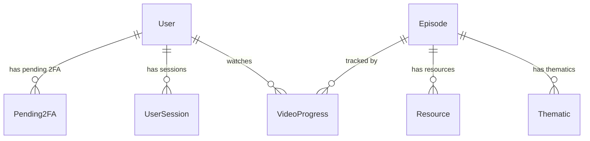

# Modèles de Données — Mouvement ECHO

## Modèles Principaux (`models.py`)

### User

| Champ | Type | Défaut | Description |
|-------|------|--------|-------------|
| `id` | `str` | UUID auto | Identifiant unique |
| `username` | `str` | — | Nom d'utilisateur unique |
| `email` | `EmailStr` | — | Email validé |
| `password_hash` | `str?` | None | Hash bcrypt (null pour OAuth) |
| `oauth_provider` | `str?` | None | `"google"` si OAuth |
| `oauth_id` | `str?` | None | ID fournisseur OAuth |
| `picture` | `str?` | None | URL avatar |
| `role` | `UserRole` | `"user"` | `"user"` ou `"admin"` |
| `is_2fa_enabled` | `bool` | false | 2FA activé |
| `totp_secret` | `str?` | None | Secret TOTP |
| `created_at` | `datetime` | now | Date de création |
| `last_login` | `datetime?` | None | Dernière connexion |

### Episode

| Champ | Type | Défaut | Description |
|-------|------|--------|-------------|
| `id` | `str` | UUID auto | Identifiant unique |
| `season` | `int` | — | Numéro de saison |
| `episode` | `int` | — | Numéro d'épisode |
| `title` | `str` | — | Titre de l'épisode |
| `description` | `str` | — | Description |
| `duration` | `str` | — | Durée (ex: "52 min") |
| `thumbnail_url` | `str` | — | URL miniature |
| `video_url` | `str` | — | URL vidéo (locale ou S3) |
| `is_published` | `bool` | false | Publié ou brouillon |
| `created_at` | `datetime` | now | — |
| `updated_at` | `datetime` | now | — |

### VideoProgress

| Champ | Type | Description |
|-------|------|-------------|
| `id` | `str` | UUID auto |
| `user_id` | `str` | Réf → User.id |
| `episode_id` | `str` | Réf → Episode.id |
| `season` / `episode` | `int` | Dénormalisés |
| `current_time` | `float` | Position en secondes |
| `duration` | `float` | Durée totale en secondes |
| `progress_percent` | `float` | Calculé (current_time/duration × 100) |
| `last_updated` | `datetime` | — |

### Pending2FA

| Champ | Type | Description |
|-------|------|-------------|
| `user_id` | `str` | Réf → User.id |
| `code` | `str` | Code à 4 chiffres |
| `attempts` | `int` | Tentatives (max 5) |
| `expires_at` | `datetime` | Expiration (10 min) |
| `created_at` | `datetime` | — |

### AnalyticsEvent

| Champ | Type | Description |
|-------|------|-------------|
| `id` | `str` | UUID auto |
| `category` | `str` | Catégorie de l'event (ex: "gamification") |
| `action` | `str` | Action réalisée (ex: "step_2_reached") |
| `path` | `str` | Chemin URL courant |
| `created_at` | `datetime` | — |

---

## Modèles Étendus (`models_extended.py`)

### Thematic

| Champ | Type | Description |
|-------|------|-------------|
| `id` | `str` | UUID auto |
| `episode_id` | `str` | Réf → Episode.id |
| `type` | `ThematicType` | sociétale, sociale, existentielle, environnementale, philosophique, spirituelle |
| `title` | `str` | Titre de la thématique |
| `description` | `str` | Description détaillée |
| `image_url` | `str?` | Image optionnelle |
| `order` | `int` | Ordre d'affichage |

### Resource

| Champ | Type | Description |
|-------|------|-------------|
| `id` | `str` | UUID auto |
| `episode_id` | `str` | Réf → Episode.id |
| `type` | `ResourceType` | vidéo, livre, article, podcast, auteur, autre |
| `title` | `str` | Titre |
| `description` | `str?` | Description |
| `url` | `str` | Lien vers la ressource |
| `image_url` | `str?` | Image |
| `author` | `str?` | Auteur |
| `order` | `int` | Ordre d'affichage |

### Actor

| Champ | Type | Description |
|-------|------|-------------|
| `id` | `str` | UUID auto |
| `name` | `str` | Nom |
| `role` | `str?` | Rôle dans la série |
| `photo_url` | `str?` | Photo |
| `bio` | `str?` | Biographie |
| `order` | `int` | Ordre d'affichage |

---

## Relations

