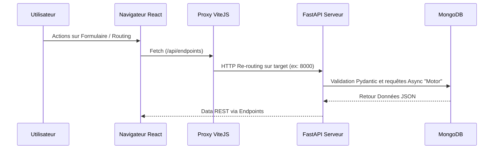

# Architecture d'Intégration — Monorepo

Ce document décrit formellement comment la partie Client s'interface avec la partie Serveur au sein du Monorepo Mouvement ECHO.

## 1. Topologie des Couches Relais

L'écosystème comprend trois entités d'intégration asynchrones principales :
1. L'application SPA React.
2. Le reverse proxy réseau ou config `Vite Proxy`.
3. Le serveur de traitement Backend FastAPI / Motor.



## 2. Le Proxy Client Config (Vite)

Afin d'éviter tout blocage de type CORS (Cross-Origin Resource Sharing) en cours de développement, le frontend React délègue ses appels `/api` au serveur proxy embarqué de ViteJS :

```typescript
// Extrait Configuration vite.config.ts
export default defineConfig({
  server: {
    proxy: {
      '/api': {
        target: 'http://localhost:8000',
        changeOrigin: true,
      },
    },
  }
})
```
Ce découplage permet d'utiliser les mêmes URIs statiques dans le code Front que ce soit en dév ou en production (`fetch('/api/users')`).

## 3. Gestion Identitaire Inter-Parties

La persistance des actions utilisateur est garantie par un **Session ID sécurisé et exclusif HTTP**.
- Lors de la connexion, le backend Python inscrit le cookie dans l'en-tête natif de sa reponse.
- La SPA conserve ce cookie opaque (marqué HttpOnly et parfois Strict/Lax) en lévitation.
- Les futurs appels (ex: Suppression de ressource, Candidatures) de React vers FastAPI contiendront implicitement les credentials via le `credentials: 'include'` de Javascript.

Cela maintient la flexibilité des applications Multi-Parties sans exposition de vecteurs d'attaque JWT (LocalStorage) côté React.
